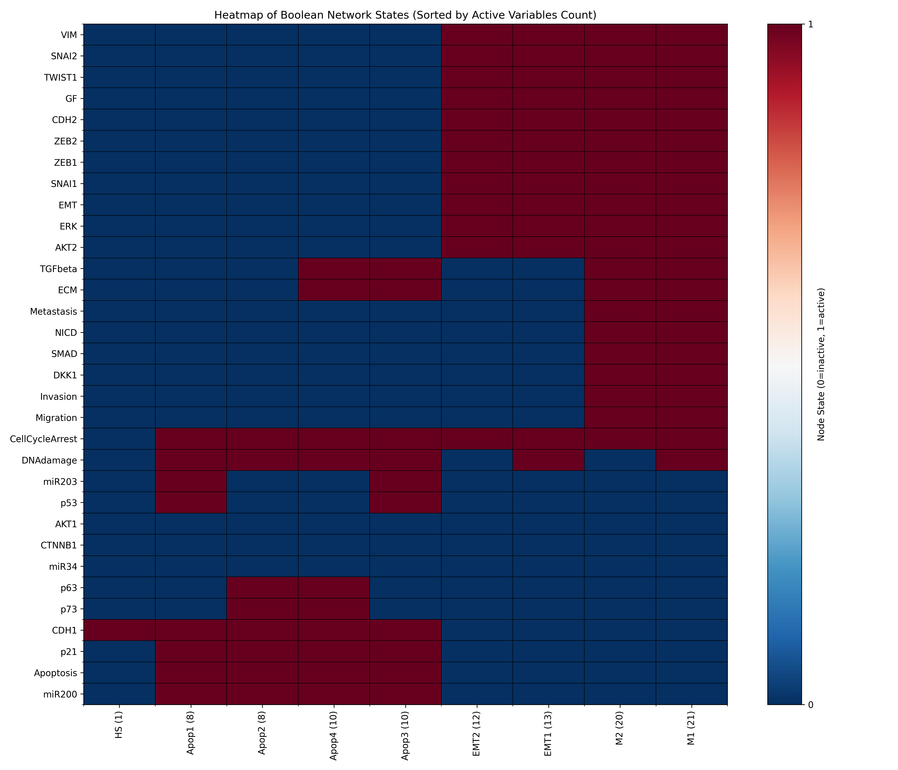

# Modeling and Simulating Tumor Metastasis Dynamics with a Boolean Network

In this repository, we present a boolean network model of metastasis dynamics. Our work is primarily based on 
*Cohen et al (2015)*.

## Model definition & Boolean Formalism

The main genes involved in the activation of EMT (Epithelial to Mesenchymal Transition) in tumor cells, which regulated early invasion and triggers metastasis, were first identified. Subsequently, experimentally proven physical interactions between these genes were extracted from scientific articles to create the influence network and formalize the boolean network. 

For instance, it has been reported that AKT phosphorylates and stabilises MDM2, which in turn inhibits p53. Thus, a negative edge is added from AKT1/2 to p53 in the influence network and the logical rule for p53 includes the negation of these 2 genes: `p53: (DNAdamage | CTNNB1 | NICD | miR34) & ~SNAI2 & ~p73 & ~AKT1 & ~AKT2`.

The variables in the model could be divided into: 
* Inputs: *DNAdamage* and *ECMicroenv* (Extracellular Matrix micronvironment). *GF* (Growth Factors) could be added to this category, but it differs in that it depends on other variables in the model.
* Final/Intermediate phenotypic outputs: *Migration*, *Invasion*, *Metastasis*, *EMT*, *Apoptosis*, and *CellCycleArrest*.
* Gene and miRNA players. 

We note that the model is defined for one cell rather than a population of tumor cells. Moreover, besides the full model, a reduced modular model is provided by lumping variables into modules corresponding to signalling pathways (e.g. TGF-β pathway *TGFb_pthw*: TGFbeta, SMAD; WNT pathway *WNT_pthw*: DKK1, CTNNB1). This reduced model has a total of 20 variables (nodes) compared to the 32 of the full model. The input and phenotype variables are maintained the same in it.

## Code Structure

### The MetastasisModel Class

We define `MetastasisModel` to include both the full and reduced model variables and logical rules. The `modular` parameter allows for the instantiation of either the full model (default one) or the modular one. This involves the creation of a BooN model that is added as an attribute of the instantiated object.

### Utils 

Along the way, We defined a set of versatile functions that are mostly adopted by `MetastasisModel` behaviors. For instance, a `MetastasisModel` instance makes use of 3 visualization functions to provide multiple options for drawing the influence network graph. The `split` argument allows the seperation of activation and inhibition subnetworks, while `interactive` uses pyviz library to create an interactive html file of the model graph. By default, the method saves the resulting plots, and they could be also shown is `show` is set to True.

```python
def draw_interaction_graph(self, name, split=False, interactive=False, show=False):
    draw_interaction_graph(self.model.interaction_graph, name, show)
    if split:
        draw_act_inh_seperately(self.model.interaction_graph, name, show)
    if interactive:
        draw_network_interactive(self.model.interaction_graph, name)
```

### Full_Model & Modular_Model 

Scripts [full_model.py](full_model.py) and [modular_model.py](modular_model.py) showcase the equivalent of a user interface, where the two versions of the model are instantiated to run the different functionalities relevant to our analysis

Additionally, we provide a jupyter notebook [notebook.ipynb](notebook.ipynb) to illustrate how our code could be run.

## Initial Exploratory Analysis

### Interactions Network Visualization


### Stable States

`identify_stable_states()` to which we later added Inv and CCA to match the authors results 




## Equilibria

attractors - enhanced BooN code - saved the model and ran quotient_graph only on scc > 1 => 7 cyclic attractors. Notably one of size 4 

## Controllability Analysis

The authors approach
BooN - added max_cnf 

## References

- Cohen DPA, Martignetti L, Robine S, Barillot E, Zinovyev A, Calzone L (2015) Mathematical Modelling of Molecular Pathways Enabling Tumour Cell Invasion and Migration. PLoS Comput Biol 11(11): e1004571. https://doi.org/10.1371/journal.pcbi.1004571