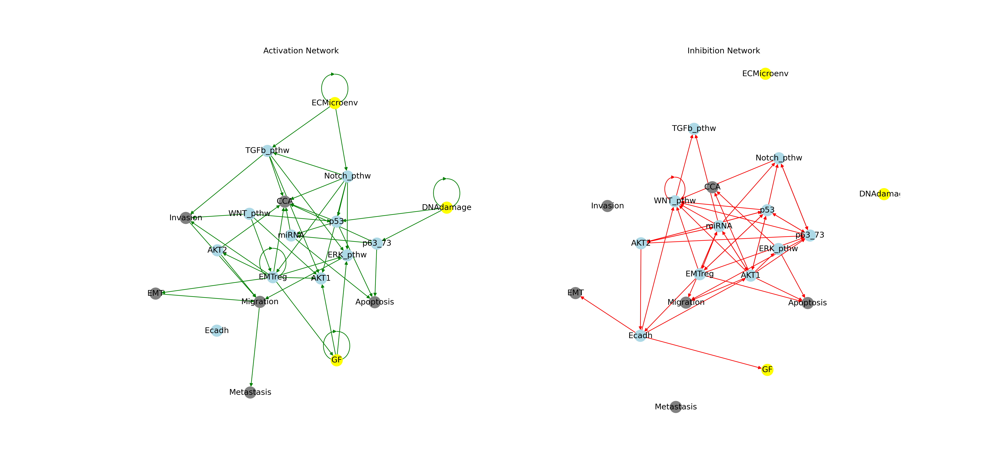
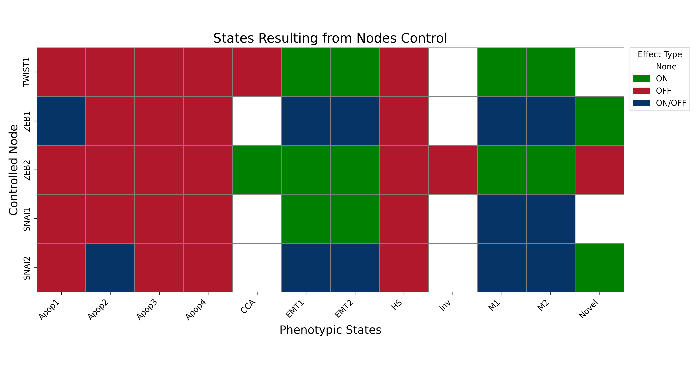

# Modeling and Simulating Tumor Metastasis Dynamics with a Boolean Network

In this repository, we present a boolean network model of metastasis dynamics. Our work is primarily based on 
*Cohen et al (2015)*.

## Model definition & Boolean Formalism

The main genes involved in the activation of EMT (Epithelial to Mesenchymal Transition) in tumor cells, which regulates early invasion and triggers metastasis, were first identified. Subsequently, experimentally proven physical interactions between these genes were extracted from scientific articles to create the influence network and formalize the boolean model. 

For instance, it has been reported that AKT phosphorylates and stabilises MDM2, which in turn inhibits p53. Thus, a negative edge is added from AKT1/2 to p53 in the influence network and the logical rule for p53 includes the negation of these 2 genes: `p53: (DNAdamage | CTNNB1 | NICD | miR34) & ~SNAI2 & ~p73 & ~AKT1 & ~AKT2`.

The variables in the model could be divided into: 
* Inputs: *DNAdamage* and *ECMicroenv* (Extracellular Matrix micronvironment). *GF* (Growth Factors) could be added to this category, but it differs in that it depends on other variables in the model.
* Final/Intermediate phenotypic outputs: *Migration*, *Invasion*, *Metastasis*, *EMT*, *Apoptosis*, and *CellCycleArrest*.
* Gene and miRNA players. 

We note that the model is defined for one cell rather than a population of tumor cells. Moreover, besides the full model, a reduced modular model is provided by lumping variables into modules corresponding to signalling pathways (e.g. TGF-β pathway *TGFb_pthw*: TGFbeta, SMAD; WNT pathway *WNT_pthw*: DKK1, CTNNB1). This reduced model has a total of 20 variables (nodes) compared to the 32 of the full model. The input and phenotype variables are maintained the same in it.

## Code Structure

### The MetastasisModel Class

We define `MetastasisModel` to include both the full and reduced model variables and logical rules. The `modular` parameter allows for the instantiation of either the full model (default one) or the modular one. This involves the creation of a BooN model that is added as an attribute of the instantiated object.

### Utils 

Along the way, We defined a set of versatile functions that are mostly adopted by `MetastasisModel` behaviors. For instance, a `MetastasisModel` instance makes use of 3 visualization functions to provide multiple options for drawing the influence network graph. The `split` argument allows the separation of activation and inhibition subnetworks, while `interactive` uses pyviz library to create an interactive html file of the model graph. By default, the method saves the resulting plots, and they could be also shown if `show` is set to True.

```python
def draw_interaction_graph(self, name, split=False, interactive=False, show=False):
    draw_interaction_graph(self.model.interaction_graph, name, show)
    if split:
        draw_act_inh_seperately(self.model.interaction_graph, name, show)
    if interactive:
        draw_network_interactive(self.model.interaction_graph, name)
```

### Full_Model & Modular_Model 

Scripts [full_model.py](full_model.py) and [modular_model.py](modular_model.py) showcase the equivalent of a user interface, where the two versions of the model are instantiated to run the different functionalities relevant to our analysis

Additionally, we provide a jupyter notebook [notebook.ipynb](notebook.ipynb) to illustrate how our code could be run.

We note that we had to modify some of BooN functions for our analysis. Most notably, we redefined the `model` function to process and add edges to the state transition graph in batches to avoid memory overflow given the size of our network.

## Initial Exploratory Analysis

### Interactions Network Visualization

Besides the defined logical rules, the interaction graph provides a useful visualization of the studied model. Thus, we present multiple options for visualization, most notably the interactive HTML option [interactive_influence_network](plots/reduced_model_interaction_graph.html).

In the networks below, we highlight input nodes in yellow and phenotypes in grey. 




### Stable States

We created multiple functionalities to handle stable states, most notably `identify_stable_states()` which labels all identified stable states based on the criteria provided by the authors (the homeostatic phenotype has only CDH1 ON, there are 4 apoptosis phenotypes which differ based on the genes activated with each of them, etc.). Afterwards, we added the Inv and CCA stable state labels to match the authors results reported in controllability analysis. We label all other states "Novel". We also allow the option of setting `prevent_duplicates` to True to identify different states that would be classified within the same category but have small differences in the modules or genes activated with the main phenotype detected.

We highlight below the 9 stable states identified for both the full and reduced models, ordered by the number of active variables per state with the rows clustered based on their ON/OFF values over all stable states. 


 

## Extensions

### Identifying Cyclic Attractors

We used BooN `equilibria` functionality to identify cyclic attractors that the authors failed to report. They could be found in [cyclic_attractors](data_files/cyclic_attractors.txt). To this end, we only kept strongly connected components with size > 1 to avoid the very high running time. 

### Model Robustness

We defined a function `robustness` that recursively creates variations of the model with single changes of operators from And to Or, or vice versa. This allows us to compute the stable states for each and assess how they tend to evolve across models.

### Controllability Analysis

We define a `controllability_analysis` that assesses the effects of setting each variable to True or False. It saves the identified stable states in each case and use `identify_stable_states()` to label them. It also offers an option to draw them in a heatmap representation.


### Specific Regulators GoF/LoF Analaysis

Similarly, we provide a functionality allowing the assessment of the GoF/LoF effects of variables specified by the user.

```python
full_model.controllability_analysis('EMT-regulators', vars=['TWIST1','ZEB1','ZEB2','SNAI1','SNAI2'],prevent_duplicates=False, plot=True)
```


### Necessary Queries Analysis

We tried to define a `necessary` function that makes use of BooN necessary functionality to identify  the conditions that will necessarily lead to queries of interest, such as Metastasis=Migration=Invasion=EMT=True, or Metastasis=False:

```python
full_model.necessary(trueset={'Metastasis','Migration','Invasion','EMT'}, trace=True) 
```
However, `supercnf` which is required for this function was taking forever to compute and we could not get any results. We tried to specify a max number of clauses to be considered after which we compute some solutions, but then we realized that not taking all clauses into consideration will not simply mean that we will get some solutions and miss others, but also that the solutions we will get will not be necessarily accurate. We could still check the accuracy of those that seems most logical. We highlight below the process of running this function for a max number of clauses 150000, which still does not exhaust all of them, and despite that the computation of solutions is stuck and still going:

```
BooN CNF >> # SAT models:[148032]
BooN CNF >> CNF formatting: 100% |█████████████████[148032 - 06:23 - 385.68it/s]
# clauses: 147971
BooN PI >> # solutions:[ 28]
```

Despite failing to identify these interesting results, we were able to verify some conditions that would lead to the queries we were interested in, such as the one highlighted below which always lead to Metastasis:

```python
mutated_model = full_model.control(frozentrue={'NICD'}, frozenfalse={'p53'})
mutated_model.get_stable_states_df(display=True)
```

## References

- Cohen DPA, Martignetti L, Robine S, Barillot E, Zinovyev A, Calzone L (2015) Mathematical Modelling of Molecular Pathways Enabling Tumour Cell Invasion and Migration. PLoS Comput Biol 11(11): e1004571. https://doi.org/10.1371/journal.pcbi.1004571